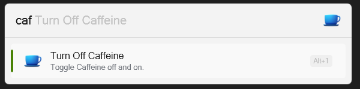

Caffeine for Flow Launcher
==================
A plugin for [Flow launcher](https://github.com/Flow-Launcher/Flow.Launcher) that prevents your pc from sleeping or turning off the monitor.  
This is a replacement for [Caffeine](https://www.zhornsoftware.co.uk/caffeine/) that simply keeps your pc awake and screen on when active.  

Icons from [icons8](https://icons8.com/).  
Thanks for that one guy on stackexchange that had a nice clean example of how power management works.

### Usage

Type the following into [flow launcher](https://github.com/Flow-Launcher/Flow.Launcher) query and click/enter result to toggle caffeine :)



### Timed Mode

Keep your PC awake for a specific duration instead of indefinitely:

| Command | Effect |
|---------|--------|
| `caf` | Show duration presets (30m, 1h, 2h, 5h, 8h, indefinite) |
| `caf 3` | Keep awake for 3 hours |
| `caf 45m` | Keep awake for 45 minutes |
| `caf 1.5` | Keep awake for 1.5 hours (90 minutes) |
| `caf off` | Turn off caffeine |

When caffeine is active with a timer, the remaining time is shown in the query results and tray icon tooltip.

Right-click the tray icon for quick access to duration presets and turn off.

### Settings


> **Note:**  
> The image above show the default settings for the plugin.

## Installation

1. Install [flow launcher](https://github.com/Flow-Launcher/Flow.Launcher) if you haven't already.
2. Execute the following command in [flow launcher](https://github.com/Flow-Launcher/Flow.Launcher) query to install the plugin.

```cmd
pm install Caffeine by o850cHQk
```

or

Search for `Caffeine` within [flow launchers](https://github.com/Flow-Launcher/Flow.Launcher) plugin store
